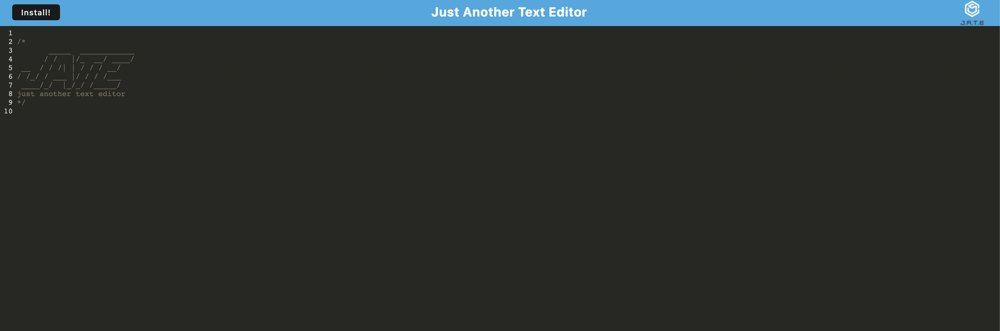

# PWA-Just-Another-Text-Editor

## Description

The purpose of this project was to build a single-page application that meets Progressive Web Application criteria. This application allows the user to view and edit text offline and features JavaScript syntax highlighting. The user also has the option of installing the application on their desktop. While building this project, I became comfortable utilizing webpack plugins and IndexedDB storage.

## Usage

  To access this application, visit the following URL: [https://jate-text-editing.herokuapp.com/](https://jata-pwa-editor.herokuapp.com/) and start editing the text.

  